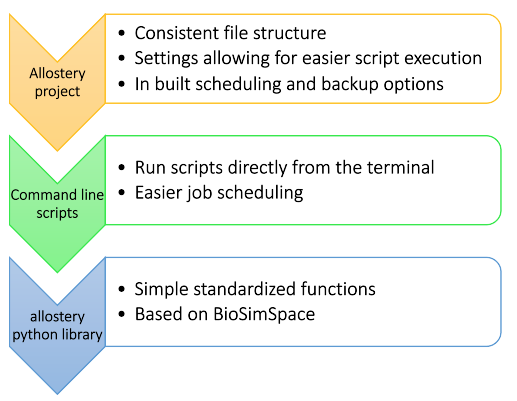

# AMMo

AMMo (Allostery in Markov Models) is a collection of a python library, command line scripts and tools, for assessing allosteric modulators. The main use for easier Markov State Model building and comparison, using steered MD simulations to explore a larger conformational space. Depending on how much customization is desired, there are 3 levels of tools available:

The highest level is the set of command line tools that create and run an [AMMo project](examples/project.md). The lowest level is the [ammo python library](examples/notebook.ipynb), with some default functions to run and analyse MD simulations (if even more customization is needed, [BioSimSpace](www.biosimspace.org) is recommended to set up own simulations). The [command line scrips](examples/scripts.md) simply run the functions available in the python library from the command line, allowing for easier execution and job scheduling. More information on how to use each of these can be found in [examples](examples).

### Installation

To use `ammo`, clone this repository and run `python setup.py`.

### Requirements

* a python evnironment containing:
    * BioSimSpace
    * pytraj[^1]
* AMBER[^1]
* GROMACS

[^1]: If AMBER is compiled with pytraj compatible with the BioSimSpace environment, a separate installation of pytraj is not needed. If AMBER is compiled with pytraj that is not compatible with the BioSimSpace environment, it needs to be removed from `PYTHONPATH` and a separate pytraj installed in the environment.
