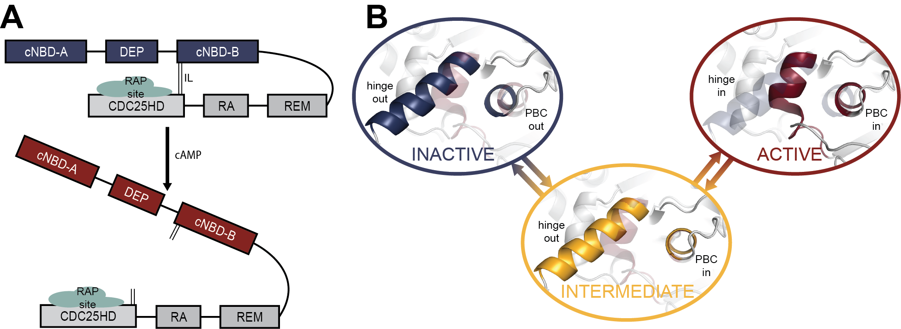
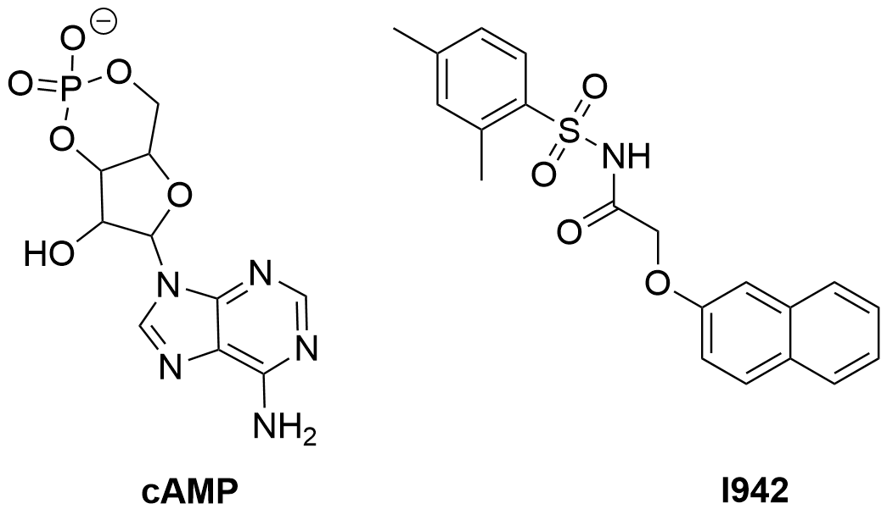

# Example - EPACs

An example application of AMMo to a protein system - Exchange Proteins Activated by cAMP (EPACs).

The EPACs family of proteins consists of EPAC1 and EPAC2. The main difference between the two proteins is the additional cyclic nucleotide binding domain (cNDB) in EPAC2, while EPAC1 only contains 1 (Figure 1a). Both proteins primarily populate an auto-inhibited state, where the regulatory region (RR) covers the RAP protein binding site on the catalytic region (CR). Upon binding of cAMP, the RR moves by 45 $\AA$ to expose the binding site and so activating EPAC[[1]](#1). This is facilitated by smaller structural changes within the cNBD, mainly the hinge and the phosphate binding casette (PBC). The differences between the active and inactive conformations are shown in Figure 1b.



*Figure 1: Activation of EPACs by cAMP. (A) In apo EPACs, the RR (blue) covers the RAP binding site on the CR (grey). When cAMP binds, the RR moves, exposing the site. cNBD-A is present in EPAC2 only. (B) The hinge and PBC changes during the activation of EPACs*

The search for selective activators of EPACs has led to I942, a partial EPAC1 agonist. It also shows good affinity for EPAC2 but does not activate it. The partial agonism of I942 is propsed to be due to its stabilization of an intermediate state, rather than an active one. Figure 1b shows how in the intermediate state, the PBC is shifted to the "in" conformation seen in the active state, but the hinge remains in the inactive "out" conformation. Here AMMo is applied to model the activation of EPAC1 by cAMP, and the partial activation through the intermediate state by I942. Both ligands are shown in Figure 2 below.



*Figure 2: cAMP (left) and I942 (right).*

## Contents

1. [Preparation](#preparation)
2. [Setup](#setup)
3. [Equilibrium MD](#equilibrium-md)
4. [Steered MD](#steered-md)
5. [Seeded MD](#seeded-md)
6. [Data featurization and MSMs](#data-featurization-and-MSMs)
7. [References](#references)

## Preparation
[top](#example---epacs)

An AMMo project is created for EPACS:

```bash
$ ammo project --create EPACs
```

This creates all of the required folders, and allows to enter the settings for the project. The settings used for this work are given in `.defaults/config`. Additionally, all required systems can be created as follows:

```bash
$ ammo systems --create [name]
```

The systems created here were: apo, cAMP, I942, and L273W. The active and inactive states are specified in `.defaults/config`:

```bash
states :
    - active
    - inactive
```

The input files are available in `inputs`.

## Setup
[top](#example---epacs)

Each system was solvated in a 15 $\AA$ shell with 100 mM NaCl, and prepared using GROMACS with 7500 minimization steps, 500 ps NVT heating, and 2000 NPT equilibration. This is specified in the `.defaults/config` entries:

```bash
setup :
  GROMACS: 7500,500,2000
solvation: "shell,15"
```

Setup for each system and state is run with AMMo. For example, the apo inactive state:

```bash
$ ammo setup --system apo --state inactive --input inputs/inactive.pdb --slurm
```

## Equilibrium MD
[top](#example---epacs)

Long equilibrium MD of the **apo** EPAC1 in both active and inactive states was run to investigate system behaviour (later used to define metastable states for the MSMs). The command to run the inactive state for example was:

```bash
$ ammo equilibrium --system apo --state inactive --duration 1000 --slurm
```

## Steered MD
[top](#example---epacs)

The sMD for this system is carried out in 2 separate steps, due to the 2 step activation mechanism outlined in Figure 1b. The pseudo-PLUMED input files are specified in the settings:

```bash
steering:
  active:
    input_1: active_to_inactive_1.dat
    input_2: active_to_inactive_2.dat
  inactive:
    input_1: inactive_to_active_1.dat
    input_2: inactive_to_active_2.dat
```

As an example, the input file for the first step of steering from inactive to active conformation is:

```bash
hinge: RMSD REFERENCE=:129-142&(@CA,C,N,O) TYPE=OPTIMAL FILE=intermediate_ref_cNBD_l273w.pdb
pbc: RMSD REFERENCE=:102-106&(@CA,C,N,O) TYPE=OPTIMAL FILE=intermediate_ref_cNBD_l273w.pdb
cnbd: RMSD REFERENCE=:1-292&(@CA,C,N,O) TYPE=OPTIMAL FILE=active_ref_l273w.pdb

MOVINGRESTRAINT ...
  ARG=hinge,pbc,cnbd
  VERSE=B,B,B
  STEP0=0               AT0=initial,initial,initial     KAPPA0=0.00,0.00,0.00
  STEP1=2000            AT1=initial,initial,initial     KAPPA1=3500.00,3500.00,3500.00
  STEP2=30000000        AT2=0.0,0.0,initial/2           KAPPA2=3500.00,3500.00,3500.00
  STEP3=31000000        AT3=0.0,0.0,initial/2           KAPPA3=0.00,0.00,0.00
... MOVINGRESTRAINT
PRINT STRIDE=2500 ARG=* FILE=steering_1.dat
```

The `FILE=` input is removed upon PLUMED input preparation, and the reference is created based on the AMBER selection mask in `REFERENCE=`. The mask is then replaced with the reference file name. Additionally, the `initial` values for each CV are computed using PLUMED and added to the input file. The reference files are changed to either contain the L273W mutation or not, depending on the system. The steering run is submitted as:

```bash
$ ammo steering --system apo --state inactive --seeded seeded-md_2step --slurm
```

When required, the restraint file is also specified with `--restraint`. The above command will run both steering steps one after another.

100 snapshots are evenly sampled from both sMD steps together, and used as new starting points in seeded MD below. Example analysis is given in the `sMD_analysis.ipynb` notebook.

## Seeded MD
[top](#example---epacs)

Once 100 snapshots are obtained for each system/state, they are used as new starting coordinates for further 50 ns of unbiased MD simulation. This is recommended to be done on an HPC cluster with multiple GPU access, as the individuals runs themselves are quite short but numerous. This can be done automatically by specifying a remote host and location in the settings, as well as the seeded MD duration in ns:

```bash
snapshot_duration : 50

cluster : user@hpc.cluster
cluster_path: /path/to/EPAC1
```

A simple submission script also needs to be provided. An example is given in `.defaults/seeded-md.sh`. Then the jobs can be submitted from the local workstation by running:

```bash
$ ammo seeded --system apo --state inactive --folder seeded-md_2step
```

The submission script will be modified to `rsync` the files from the remote cluster to the local machine.

## Data featurization and MSMs
[top](#example---epacs)

Once all of the seeeded MD runs are finished for a system/state, the trajectories can be featurized. Again, the features are specified in the settings file:

```bash
features :
  domain_angle:
    feature: angle
    mask: ":121-125&(@CA,C,N,O) :250-263&(@CA,C,N,O) :701-704&(@CA,C,N,O)"
  hinge:
    feature: rmsd
    mask: ":250-263&(@CA,C,N,O)"
    reference: inactive.pdb
    shared: ":122-263&!(@/H)"
  pbc:
    feature: rmsd
    mask: ":223-227&(@CA,C,N,O)"
    reference: inactive.pdb
    shared: ":122-263&!(@/H)"
```

The masks used are AMBER selection masks. The `shared:` parameter indicates atoms to be used for aligning the trajectories to the reference for RMSD calculations. The feature output files will be named `[feature].txt`. The featurized seeded MD data used here is provided. Featurization is submitted with AMMo:

```bash
$ ammo featurize --system apo --state inactive --folder seeded-md_2step --slurm
```

Once all seeded MD runs are completed and featurized, this data is used in the final step of building MSMs. The AMMo python library provides an `MSMCollection` class, which builds multiple MSMs at the same time, using the same state definitions and allowing for easy probability comparison. The code for building the MSMs for EPAC1 is available in `analysis/results.ipynb`.

## References

<a id="1">[1]</a> Rooij, J. D.; Rehmann, H.; Triest, M. V.; Cool, R. H.; Wittinghofer, A.; Bos, J. L. *J. Biol. Chem.*, **2000**, 275, 20829–20836.

<a id="2">[2]</a> Rehmann, H.; Arias-Palomo, E.; Hadders, M. A.; Schwede, F.; Llorca, O.; Bos, J. L. *Nature*, **2008**, 455, 124–127.

<a id="3">[3]</a> Shao, H.; Mohamed, H.; Boulton, S.; Huang, J.; Wang, P.; Chen, H.; Zhou, J.; Luchowska-Stańska, U.; Jentsch, N. G.; Armstrong, A. L.; Magolan, J.; Yarwood, S.; Melacini, G. *J. Med. Chem.*, **2020**, 63, 4762–4775.