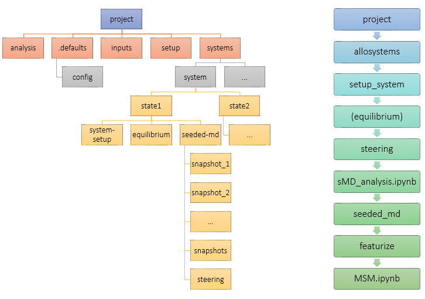

# An allostery project example

The highest level use of `allostery` is to create and run an allostery project. It uses the same functions and scripts outlined in other examples, but makes use of a consistent file structure and a settings file.

The file structure as well as a suggested workflow are shown below:



Before starting with an allostery project, make sure that the `ALLOSTERYHOME` environment variable is set by either setting it manually to this main directory, or by running `source allostery.sh` if you ran `python setup.py` when the code was downloaded.

## Creating an allostery project

Allostery projects are managed by the `project` tool from the command line.

```bash
$ project -h
usage: project [-h]
               (--create CREATE | --activate ACTIVATE | --current | --reconfigure)

manage allostery projects

optional arguments:
  -h, --help           show this help message and exit
  --create CREATE      create a new project
  --activate ACTIVATE  set active project
  --current            show current project
  --reconfigure        change active project configuration
  ```

We start by creating a project:
```bash
$ project --create my_project
------------------------------
Creating project: my_project
Created project /home/adele/Documents/my_project
..............................
Configuring project...done.
------------------------------
Project activated: my_project
```
Running this also opens the configuration file to set some defaults (here is a good point to set the `python` setting to an interpreter from an environment containing BioSimSpace and pytraj). This can always be edited directly or by running `project --reconfigure`.

The projects will be placed in the directory setup during setup. The project structure is as follows:
```bash
my_project
├── analysis      -- any analysis scripts to be placed here
├── .defaults
│   └── config    -- contains project defaults
├── inputs        -- contains input structures as well as any RMSD references
├── setup         -- for any "dirty" system preparation work
└── systems       -- main data folder
```

The expected structure of the `systems` directory is something like:
```bash
systems
├── apo                         -- system
│   ├── active                  -- state
│   │   ├── equilibrium
│   │   ├── seeded-md
│   │   │   ├── snapshot_1
│   │   │   ├── snapshot_2
│   │   │   ├── snapshot_3
│   │   │   ├── ...
│   │   │   ├── snapshots
│   │   │   └── steering
│   │   └── system-setup
│   └── inactive                -- state
│       ├── equilibrium
│       ├── seeded-md
│       │   ├── snapshot_1
│       │   ├── snapshot_2
│       │   ├── snapshot_3
│       │   ├── ...
│       │   ├── snapshots
│       │   └── steering
│       └── system-setup
├── ...
```
`systems` contains variations on the project systems that will utimately have Markov State Models associated with them, such as the apo protein or the protein with a ligand. Each system has a sub-directory corresponding to each state of the system, e.g. active and inactive, or open and closed. For each state, there is a folder for system setup files (for coordinates and topology), a folder for any equilibrium MD simulations, and a folder for seeded MD simulations. Since each steered MD trajectory provides snapshots for seeded MD trajectories, the associated steering folder is in the seeded MD folder. Multiple seeded MD folders can exist for a state (for example if different sMD protocols are tested), and their expected names are `seeded-md_[descriptor]`.

A `system` can be created by either manually creating directories or using the `allosystems` command:
```bash
$ allosystems -h
usage: allosystems [-h]
                   (--create CREATE | --add_state ADD_STATE | --remove_state REMOVE_STATE)

manage systems in the currently active allostery project

optional arguments:
  -h, --help            show this help message and exit
  --create CREATE       Add a new system
  --add_state ADD_STATE
                        Add a new state to systems. Will also change the
                        project configuration
  --remove_state REMOVE_STATE
                        Remove a state from systems. Will also change the
                        projectconfiguration
```

Folders for each state specified in the project settings will be created with the system. The states were left as the example `state1` and `state2`.

Let's create a system:
```bash
$ project --activate my_project
Project activated: my_project
$ allosystems --create my_system
System my_system created
```

## System setup
A common starting point in MD simulations is a PDB file. To begin working with a system, run the `setup_system` command:
```bash
$ setup_system -h
usage: setup_system [-h] --input INPUT --system SYSTEM --state STATE
                    [--engine ENGINE] [--charges CHARGES]
                    [--topology TOPOLOGY] [--slurm]

Set up a protein system

optional arguments:
  -h, --help           show this help message and exit
  --input INPUT        System PDB file
  --system SYSTEM      Allostery project system, e.g. "apo"
  --state STATE        Allostery project system state, e.g. "active"
  --engine ENGINE      Simulation engine used for setup. Can be "AMBER" or
                       "GROMACS". Default : "GROMACS"
  --charges CHARGES    Ligand charges in the order they appear in the input
                       PDB, comma separated
  --topology TOPOLOGY  Dry topology of system. If provided will be used
                       instead of re-parameterising
  --slurm              Whether to run setup as a slurm job
```

In the simplest case, only the input PDB needs to be provided, together with the system and state it corresponds to. `setup_system` runs the `setup_system.py` script, but uses the protocol set in the project defaults. An example of that YAML portion would look something like this:
```bash
setup :
    GROMACS: 7500,100,250
parameters : "source leaprc.phosaa10"
```
When the GROMACS MD engine is used for system setup, the input will be minimised for 7500 steps, heated to 300 K in 100 ps and further equilibrated for 250 ps. Additionally, when the main protein or other peptides are parameterised, an additional command `source leaprc.phosaa10` will be executed by tLeAP.

The system setup can be submitted as a slurm job (support for other schedulers coming!). From the project directory:
```bash
$ setup_system --input inputs/input_protein.pdb --system my_system --state state1
Submitted batch job 16490
```

The main output files (found in `systems/my_system/state1/system-setup`) are `system.prm7` and `system_equilibrated.rst7`. They will be used to run the steered MD simulations. Alternatively, other topology and coordinate files can simply be placed in `system-setup`, as long as they are named appropriately.

## Running steered MD

Once the system is prepared, the next step is to run steered MD simulations. This allows for better sampling of intermediate conformations which are unstable and therefore short-lived. As part of an allostery project, this can be done with the `steering` command:

```bash
$ steering -h
usage: steering [-h] --system SYSTEM --state STATE [--seeded SEEDED] [--engine ENGINE] [--slurm] [--backup]

Run a steered MD simulation

optional arguments:
  -h, --help       show this help message and exit
  --system SYSTEM  project system
  --state STATE    system state
  --seeded SEEDED  seeded MD folder where the steering folder is. Default : seeded-md
  --engine ENGINE  MD engine to run sMD with
  --slurm          Whether to run sMD as a slurm job
  --backup         Backup wet trajectory
```

In the simples case, all that needs to be provided is the `--system` and `--state` that the sMD is to be run for. This functionality makes use of the consistent topology and coordinate file location, and the settings file. An example of the settings to run an sMD simulation would look something like this:
```bash
steering :
    state1:
        masks: [":153&(@N,CA,CB,CG)",":197@CG :281@CG",":179-185&!(@/H)"]
        types: ["torsion","distance","rmsd"]
        timings: [100]
        values: [-1.047, 0.7, 0]
        forces: [2500,2500,2500]
        reference: reference.pdb
```
In this case, the CVs will be the $\chi$1 angle of Tyr152, the distance between C$\gamma$ atoms of residues 196 and 280, and the heavy atom RMSD of residues 178-184. Note that in the masks below, the residue numbers are offset by 1. The system includes an ACE cap at the start, and the mask selection indexes starting from 1. The steering will be carried out in 100 ns. The `reference` parameter is pointing to a file in the `inputs` directory of the project. In addition to the specified values, times, and forces, additional steps will be added to apply the force over 4 ps, keeping the CV values as initial. The target values and forces used are based on knowledge of the system.

Steering is submitted as a slurm job:
```bash
$ steering --system my_system --state state1 --slurm --backup
Submitted batch job 16491
```

Since `--backup` is specified, the wet trajectory will be backed up to a remote storage solution, as specified in the settings:
```bash
backup: user@remote.address
backup_path: /path/to/remote/project
```
Any required directories will be created. This requires ssh keys to be set up between the local and remote machines.

#### Multiple step steering

In order to specify multiple steering steps, `timings`, `values` and `forces` need to be provided. For example, if we wanted to steer the dihedral angle during the first 50 ns of the simulation and the distance during the second, while steering the RMSD throughout, the settings would look like this:
```bash
steering :
    state1:
        masks: [":153&(@N,CA,CB,CG)",":197@CG :281@CG",":179-185&!(@/H)"]
        types: ["torsion","distance","rmsd"]
        timings: [50,100]
        values: [[-1.047,-1.047],["initial",0.7],["initial/2",0]]
        forces: [[2500,2500],[2500,2500],[2500,2500]]
        reference: reference.pdb
```

Note that simple mathematical operations are allowed for the initial value, and this way the RMSD steering is not affected.

In this case the dihedral angle CV was steered to its target value and kept constant by applying force, while the distance CV was kept at its initial value by applying force during the first half of the simulation. An alternative protocol where they are not steered at all beyond changing the CV value could be employed by simply changing the appropriate force constants to 0.

## Analysing steered MD data

Once a steered MD trajectory is produced, it has to be checked to ensure steering has been successful, and snapshots need to be saved for seeded MD simulations. When an allostery project is created, a notebook called `sMD_analysis.ipynb` is placed in the `analysis` folder. The notebook checks available systems and states, and allows the user to select which steered MD trajectory is analysed:


Then PLUMED output is plotted the user. Any additional analysis to check whether steering has been successful can be done here too. Following that, a set number of snapshots is saved from the trajectory:


They are placed in a `snapshots` folder in `seeded-md`, and will be used as starting coordinates for the seeded MD simulations in the next step.

## Seeded MD
With snapshot saved from the sMD trajectory, they can be used as "seeds" to run equilibrium MD simulations. Since this involves a large number of simulations run in parallel, it will often be done on a remote HPC cluster. This requires copying over the input files, submitting a job on the remote host, and then copying back the trajectories for analysis (and optionally backing them up too).

The `seeded_md` command does all that, but required initial setup. Firstly, the cluster and local (and optionally backup) locations need to be set up in settings:
```bash
cluster: user@cluster
cluster_path: /path/to/project/on/cluster
backup: user@backup
backup_path: /path/to/project/backup
local: user@local
```
The `local` parameter is required to copy back the results. If the `cluster` and `cluster_path` parameters are not set, the seeded MD will be run locally (also as a scheduled job). The second file that needs to be configured is a `seeded-md.sh` file placed in `.defaults` of the project (i.e. `my_project/.defaults/seeded-md.sh` for this example project). This is because to run MD simulations on an HPC cluster, a variety of modules need to be loaded, and different resource parameters need to be allocated. The simplest way is to have a basic job submission script that works. An example script to work with slurm looks like this:

```bash
#!/bin/bash
#SBATCH -J seeded_MD
#SBATCH -n 1
#SBATCH --gres=gpu:1
#SBATCH --output=submit_%a.out

module load cuda/10.1
module load amber/22

/home/adele/anaconda3/envs/bss/bin/python /home/adele/Documents/allostery/allostery/scripts/seeded_md.py --folder "." --snapshot $SLURM_ARRAY_TASK_ID --duration 100
```

It uses the `seeded_md.py` script. The `seeded_md` command will also add the copying of results back to the local machine and to backup if needed. Having the script written by the user also allows for further flexibility, such as feturizing the seeded MD trajectories as part of the job.

The command has the following parameters:
```bash
$ seeded_md -h
usage: seeded_md [-h] --system SYSTEM --state STATE [--folder FOLDER] [--seeds SEEDS] [--no_backup]

Copy snapshots from a steered MD trajectory to a remote server and submit a job to run seeded MD simulations

optional arguments:
  -h, --help       show this help message and exit
  --system SYSTEM  project system
  --state STATE    system state
  --folder FOLDER  seeded MD folder. Default : seeded-md
  --seeds SEEDS    Range for seed snapshot indices (separated by "-") or indices separated by ","
  --no_backup      do not backup seeded MD data
```

In the simplest case, just the `--system` and `--state` needs to be spceified. If `seeds` are not set, the setting `snapshot_number` will be used, i.e. the seed range will be 1 to the snapshot number indicated.

```bash
$ seeded_md --system my_system --state state1
Submitted batch job 16492
```

## In progress
This tool is currently a work in progress. Functionality still to come is:
* Command line equilibrium MD
* Trajectory featurisation
* MSM building