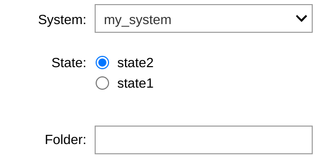

# An allostery project example

The highest level use of `allostery` is to create and run an allostery project. It uses the same functions and scripts outlined in other examples, but makes use of a consistent file structure and a settings file.

Before starting with an allostery project, make sure that the `AMMOHOME` environment variable is set by either setting it manually to this main directory, or by running `source allostery.sh` if you ran `python setup.py` when the code was downloaded.

## Contents

1. [Creating an allostery project](#Creating-an-allostery-project)
2. [System setup](#System-setup)
3. [Running steered MD](#Running-steered-MD)
4. [Analysing steered MD data](#Analysing-steered-MD-data)
5. [Seeded MD](#Seeded-MD)
6. [Trajectory featurization](#Trajectory-featurization)


All `ammo` commands can be listed as follows:

```bash
$ ammo -h

AMMo - Allostery in Markov Models
A tool for running MD simulations and building MSMs to evaluate whether a ligand is an allosteric modulator

usage: ammo [command] [command options]

    project : manage allostery projects
    systems : manage systems in the currently active allostery project
    setup : Set up a protein system
    equilibrium : Run equilibrium MD
    steering : Run a steered MD simulation
    seeded : Copy snapshots from a steered MD trajectory to a remote server and submit a job to run seeded MD simulations
    featurize : Featurize seeded MD trajectories
```

## Creating an allostery project
[top](#An-allostery-project-example)

Allostery projects are managed by the `project` tool from the command line.

```bash
$ ammo project -h
usage: project [-h]
               (--create CREATE | --activate ACTIVATE | --current | --reconfigure)

manage allostery projects

optional arguments:
  -h, --help           show this help message and exit
  --create CREATE      create a new project
  --activate ACTIVATE  set active project
  --current            show current project
  --reconfigure        change active project configuration
```

We start by creating a project:
```bash
$ ammo project --create my_project
------------------------------
Creating project: my_project
Created project /home/adele/Documents/my_project
..............................
Configuring project...done.
------------------------------
Project activated: my_project
```
Running this also opens the configuration file to set some defaults (here is a good point to set the `python` setting to an interpreter from an environment containing BioSimSpace and pytraj). This can always be edited directly or by running `project --reconfigure`.

The projects will be placed in the directory setup during setup. The project structure is as follows:
```bash
my_project
├── analysis      -- any analysis scripts to be placed here
├── .defaults
│   └── config    -- contains project defaults
├── inputs        -- contains input structures as well as any RMSD references
├── setup         -- for any "dirty" system preparation work
└── systems       -- main data folder
```

The expected structure of the `systems` directory is something like:
```bash
systems
├── apo                         -- system
│   ├── active                  -- state
│   │   ├── equilibrium
│   │   ├── seeded-md
│   │   │   ├── snapshot_1
│   │   │   ├── snapshot_2
│   │   │   ├── snapshot_3
│   │   │   ├── ...
│   │   │   ├── snapshots
│   │   │   └── steering
│   │   └── system-setup
│   └── inactive                -- state
│       ├── equilibrium
│       ├── seeded-md
│       │   ├── snapshot_1
│       │   ├── snapshot_2
│       │   ├── snapshot_3
│       │   ├── ...
│       │   ├── snapshots
│       │   └── steering
│       └── system-setup
├── ...
```
`systems` contains variations on the project systems that will utimately have Markov State Models associated with them, such as the apo protein or the protein with a ligand. Each system has a sub-directory corresponding to each state of the system, e.g. active and inactive, or open and closed. For each state, there is a folder for system setup files (for coordinates and topology), a folder for any equilibrium MD simulations, and a folder for seeded MD simulations. Since each steered MD trajectory provides snapshots for seeded MD trajectories, the associated steering folder is in the seeded MD folder. Multiple seeded MD folders can exist for a state (for example if different sMD protocols are tested), and their expected names are `seeded-md_[descriptor]`.

A `system` can be created by either manually creating directories or using the `allosystems` command:
```bash
$ ammo systems -h
usage: systems [-h]
                   (--create CREATE | --add_state ADD_STATE | --remove_state REMOVE_STATE)

manage systems in the currently active allostery project

optional arguments:
  -h, --help            show this help message and exit
  --create CREATE       Add a new system
  --add_state ADD_STATE
                        Add a new state to systems. Will also change the
                        project configuration
  --remove_state REMOVE_STATE
                        Remove a state from systems. Will also change the
                        projectconfiguration
```

Folders for each state specified in the project settings will be created with the system. The states were left as the example `state1` and `state2`.

Let's create a system:
```bash
$ ammo project --activate my_project
Project activated: my_project
$ ammo systems --create my_system
System my_system created
```

## System setup
[top](#An-allostery-project-example)

A common starting point in MD simulations is a PDB file. To begin working with a system, run the `setup` command:
```bash
$ ammo setup -h
usage: setup [-h] --input INPUT --system SYSTEM --state STATE [--engine ENGINE] [--charges CHARGES] [--topology TOPOLOGY] [--slurm]

Set up a protein system

optional arguments:
  -h, --help           show this help message and exit
  --input INPUT        System PDB file
  --system SYSTEM      Allostery project system, e.g. "apo"
  --state STATE        Allostery project system state, e.g. "active"
  --engine ENGINE      Simulation engine used for setup. Can be "AMBER" or
                       "GROMACS". Default : "GROMACS"
  --charges CHARGES    Ligand charges in the order they appear in the input
                       PDB, comma separated
  --topology TOPOLOGY  Dry topology of system. If provided will be used
                       instead of re-parameterising
  --slurm              Whether to run setup as a slurm job
```

In the simplest case, only the input PDB needs to be provided, together with the system and state it corresponds to. `setup` runs the `setup_system.py` script, but uses the protocol set in the project defaults. An example of that YAML portion would look something like this:
```bash
setup :
    GROMACS: 7500,100,250
parameters : "source leaprc.phosaa10"
solvation : "shell,15"
```
When the GROMACS MD engine is used for system setup, the input will be minimised for 7500 steps, heated to 300 K in 100 ps and further equilibrated for 250 ps. Additionally, when the main protein or other peptides are parameterised, an additional command `source leaprc.phosaa10` will be executed by tLeAP. The system will then be solvated in water with a 15 A shell.

The system setup can be submitted as a slurm job (support for other schedulers coming!). From the project directory:
```bash
$ ammo setup --input inputs/input_protein.pdb --system my_system --state state1
Submitted batch job 16490
```

The main output files (found in `systems/my_system/state1/system-setup`) are `system.prm7` and `system_equilibrated.rst7`. They will be used to run the steered MD simulations. Alternatively, other topology and coordinate files can simply be placed in `system-setup`, as long as they are named appropriately.

## Running steered MD
[top](#An-allostery-project-example)

Once the system is prepared, the next step is to run steered MD simulations. This allows for better sampling of intermediate conformations which are unstable and therefore short-lived. As part of an allostery project, this can be done with the `steering` command:

```bash
$ ammo steering -h
usage: steering [-h] --system SYSTEM --state STATE [--seeded SEEDED] [--engine ENGINE] [--slurm] [--steps STEPS] [--restraint RESTRAINT] [--backup]

Run a steered MD simulation

optional arguments:
  -h, --help            show this help message and exit
  --system SYSTEM       project system
  --state STATE         system state
  --seeded SEEDED       seeded MD folder where the steering folder is. Default : seeded-md
  --engine ENGINE       MD engine to run sMD with
  --slurm               Whether to run sMD as a slurm job
  --steps STEPS         How many sMD steps to run, if steering in more than one. "all" will run all steps from 1
  --restraint RESTRAINT
                        A pseudo flat bottom restraint file that will be used during the steering (currently only available for AMBER). Instead of atom indices, AMBER masks are used
  --backup              Backup wet trajectory
```

In the simples case, all that needs to be provided is the `--system` and `--state` that the sMD is to be run for. This functionality makes use of the consistent topology and coordinate file location, and the settings file. An example of the settings to run an sMD simulation would look something like this:
```bash
steering :
    state1:
        input: state1.dat
```
The masks are AMBER selection masks, corresponding to the atoms involved in each CV used for steering. For example, the distance between the C$\alpha$ atoms of residues 100 and 200 would be ":100@CA :200@CA". More information can be found [here](https://amberhub.chpc.utah.edu/atom-mask-selection-syntax/). In case of RMSD collective variables, an additional reference `FILE` parameter is added, which will be removed during PLUMED input preparation. First the path given will be searched as is, and then if the file is not found, the `inputs` directory of the active project will be searched. An example pseudo PLUMED input file is given in `example_data/plumed_input.dat` (as well as in the specific use case examples), and more information can be found on the [PLUMED website](https://www.plumed.org/doc-v2.8/user-doc/html/_m_o_v_i_n_g_r_e_s_t_r_a_i_n_t.html).

The `"initial"` values for the CVs at steps 0 and 1 will be computed using PLUMED and filled in during final file setup. This, together with the use of AMBER atom masks, allows for easier steering preparation while still using the whole range of CVs in PLUMED.

Steering is submitted as a slurm job:
```bash
$ ammo steering --system my_system --state state1 --slurm --backup
Submitted batch job 16491
```

Since `--backup` is specified, the wet trajectory will be backed up to a remote storage solution, as specified in the settings:
```bash
backup: user@remote.address
backup_path: /path/to/remote/project
```
Any required directories will be created. This requires ssh keys to be set up between the local and remote machines.

#### Multiple step steering

In order to specify multiple steering steps with varying CVs, multiple input files need to be provided. For a 2 step steering, the settings would look like this:
```bash
steering :
    state1:
        input_1: plumed_1.dat
        input_2: plumed_2.dat
```

The steering results in this case will be saved as `steering_1` and `steering_2` for each step. The `--steps` argument in `steering` allows to specify which steps to run.

## Analysing steered MD data
[top](#An-allostery-project-example)

Once a steered MD trajectory is produced, it has to be checked to ensure steering has been successful, and snapshots need to be saved for seeded MD simulations. When an allostery project is created, a notebook called `sMD_analysis.ipynb` is placed in the `analysis` folder. The notebook checks available systems and states, and allows the user to select which steered MD trajectory is analysed:



Then PLUMED output is plotted the user. Any additional analysis to check whether steering has been successful can be done here too. Following that, a set number of snapshots is saved from the trajectory:


They are placed in a `snapshots` folder in `seeded-md`, and will be used as starting coordinates for the seeded MD simulations in the next step.

## Seeded MD
[top](#An-allostery-project-example)

With snapshots saved from the sMD trajectory, they can be used as "seeds" to run equilibrium MD simulations. Since this involves a large number of simulations run in parallel, it will often be done on a remote HPC cluster. This requires copying over the input files, submitting a job on the remote host, and then copying back the trajectories for analysis (and optionally backing them up too).

The `seeded_md` command does all that, but required initial setup. Firstly, the cluster and local (and optionally backup) locations need to be set up in settings:
```bash
cluster: user@cluster
cluster_path: /path/to/project/on/cluster
backup: user@backup
backup_path: /path/to/project/backup
local: user@local
```
The `local` parameter is required to copy back the results. If the `cluster` and `cluster_path` parameters are not set, the seeded MD will be run locally (also as a scheduled job). The second file that needs to be configured is a `seeded-md.sh` file placed in `.defaults` of the project (i.e. `my_project/.defaults/seeded-md.sh` for this example project). This is because to run MD simulations on an HPC cluster, a variety of modules need to be loaded, and different resource parameters need to be allocated. The simplest way is to have a basic job submission script that works. An example script to work with slurm looks like this:

```bash
#!/bin/bash
#SBATCH -J seeded_MD
#SBATCH -n 1
#SBATCH --gres=gpu:1
#SBATCH --output=submit_%a.out

module load cuda/10.1
module load amber/22

/home/adele/anaconda3/envs/bss/bin/python /home/adele/Documents/allostery/allostery/scripts/seeded_md.py --folder "." --snapshot $SLURM_ARRAY_TASK_ID --duration 100
```

It uses the `seeded_md.py` script. The `seeded_md` command will also add the copying of results back to the local machine and to backup if needed. Having the script written by the user also allows for further flexibility, such as feturizing the seeded MD trajectories as part of the job.

The command has the following parameters:
```bash
$ ammo seeded_md -h
usage: seeded_md [-h] --system SYSTEM --state STATE [--folder FOLDER] [--seeds SEEDS] [--no_backup]

Copy snapshots from a steered MD trajectory to a remote server and submit a job to run seeded MD simulations

optional arguments:
  -h, --help       show this help message and exit
  --system SYSTEM  project system
  --state STATE    system state
  --folder FOLDER  seeded MD folder. Default : seeded-md
  --seeds SEEDS    Range for seed snapshot indices (separated by "-") or indices separated by ","
  --no_backup      do not backup seeded MD data
```

In the simplest case, just the `--system` and `--state` needs to be spceified. If `seeds` are not set, the setting `snapshot_number` will be used, i.e. the seed range will be 1 to the snapshot number indicated.

```bash
$ seeded_md --system my_system --state state1
Submitted batch job 16492
```

## Trajectory featurization
[top](#An-allostery-project-example)

Once seeded MD simulations are finished, they can be used to build a Markov State Model. However, that requires dimensionality reduction, which starts by reducing trajectory data from all atom coordinates to select features. The `featurize` command does this for every seeded MD trajectory in a state in a system:

```bash
$ ammo featurize -h
usage: featurize [-h] --system SYSTEM --state STATE [--folder FOLDER]
                 [--seeds SEEDS] [--slurm]

Featurize seeded MD trajectories

optional arguments:
  -h, --help       show this help message and exit
  --system SYSTEM  project system
  --state STATE    system state
  --folder FOLDER  seeded MD folder. Default : seeded-md
  --seeds SEEDS    Range for snapshot indices (separated by "-") or indices
                   separated by ","
  --slurm          Run featurization as a slurm job
```

The features computed are ones specified in settings, for example:

```bash
rmsd_feature:
    feature: rmsd
    mask: ":264-276&!(@/H)"
    reference: reference.pdb
    shared: ":122-292&!(@/H)"
distance_feature:
    feature: distance
    mask: ":215@SG @P"
```

the features are saved as `.txt` files in the snapshot directory, named as the feature is in settings, so for the above it is `rmsd_feature.txt` and `distance_feature.txt`.

An alternative approach is to add featurization to the seeded MD job file, using the python script provided.

## MSM building

An example of Markov State Modelling is available in a [notebook](msm.ipynb), as the `MSMCollection` functionality is only available as part of the `ammo` python library.
